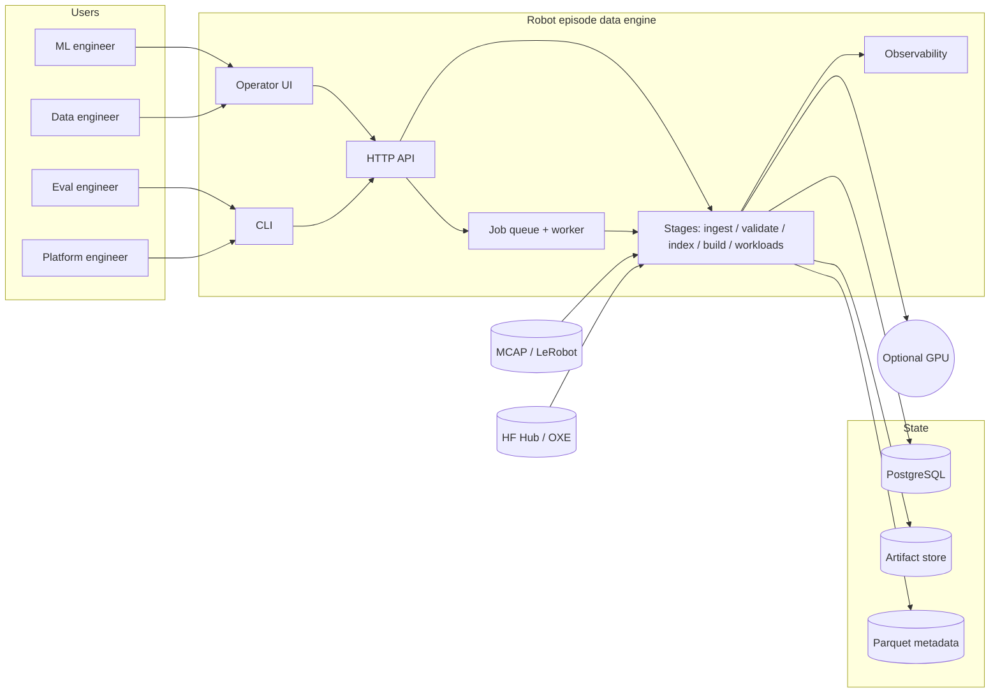

# Faultlined

A local-first data engine for robotics recordings.

- Ingests robot episodes from LeRobot datasets and MCAP logs.
- Scores each episode for data quality.
- Builds reproducible, content-addressed datasets with full lineage.

The data engine is the product. Models are workloads it runs.

## What you get

| Part | What it is |
|---|---|
| Operator UI | Browser pages for status, jobs, episodes, builds, incidents |
| HTTP API | Every UI page has a JSON equivalent under `/api/v1` |
| Fault monitor | Deterministic rules that raise incidents, no model involved |
| Benchmarks | Reproducible timings with committed baselines |

**What the browser can and cannot do today.** Ingesting a dataset and curating its task strings work from the UI.
Validating, building a content-addressed dataset, exporting a build as a LeRobot v3 dataset, and saving a curation
slice are implemented in the API but have **no UI route** — they need `curl`. The fault monitor is implemented but
not yet scheduled, so the Incidents page stays empty. Both are tracked as release blockers in
[the 2026-10-04 assessment](agents/reviews/2026-10-04-engineer-assessment-verdict.md), which also records the
measured format coverage, per-feature latency, concurrency behaviour, and the operator click budget.

## Architecture



- API submit -> Postgres queue -> worker -> content-addressed artifact -> episode/lineage catalog -> API read.
- The API never runs pipeline stages in-process; the worker does all the heavy lifting.
- Content addressing makes every blob immutable and queriable by its own SHA-256; a file is stored once and many episodes point at it.

## Quickstart

Requirements: Python 3.14, [uv](https://docs.astral.sh/uv/), [just](https://just.systems/), PostgreSQL 17+. On Windows, install [Git for Windows](https://gitforwindows.org/) so `just` has a shell.

```bash
git clone <repo-url> faultlined
cd faultlined
just setup        # installs everything into .venv
just pg-up        # starts a private database on port 55432
just run          # starts the app on http://127.0.0.1:8000
```

`just run` prints a URL. Open it. Press Ctrl+C to stop.

First time only, point the app at that database:

```bash
cp .env.example .env
```

Then set one line inside `.env`:

```bash
DE_DATABASE_URL=postgresql://data_engine@127.0.0.1:55432/data_engine
```

No password needed. Using your own PostgreSQL instead? Put its address there and skip `just pg-up`.

To stop a server you left running:

```bash
just stop
```

### One-shot smoke (no server)

```bash
just pg-up
just reset --yes
just test
```

This destroys all local catalog/artifact/metrics data, so run it on a clean box only.

## Use it

Open <http://127.0.0.1:8000/ui>.

On an empty system the Status page has an **Ingest data** form. Give it a task name and a robot, or point it at a LeRobot dataset folder or an MCAP file, and press the button. The rest of the pages fill in once there is data in.

| Page | Shows |
|---|---|
| Status | Health, ingest form, worker heartbeat |
| Jobs | Every ingest, validate and build, with cancel |
| Episodes | Catalog with quality scores and filters |
| Builds | Dataset manifests and their lineage |
| Slices | Saved filters over the catalog |
| Failures | Why episodes were quarantined |
| Incidents | What the fault monitor detected |
| Metrics | Queue, timing and throughput charts |
| Schema | The live database structure |
| Artifacts | Every stored blob |

Prefer the terminal? The full API contract is at <http://127.0.0.1:8000/openapi.json>.

## Demo script

Copy this into a terminal. It assumes `just pg-up` and a clean `just reset --yes` have already been run.

```bash
# 1. Start the platform
just run

# 2. Verify the surface the demo talks to
curl -s localhost:8000/api/v1/status | python -m json.tool

# 3. Submit a synthetic ingest job
curl -s -X POST localhost:8000/api/v1/jobs \
  -H "Content-Type: application/json" \
  -d '{"type":"ingest","payload":{"source":"python -c \\"print(b\\\"x\\\"*10000)\\"","task":"demo","robot":"demo-arm"}}' \
  | python -m json.tool

# 4. Watch it leave queued and land in the catalog
sleep 3
curl -s localhost:8000/api/v1/jobs?limit=10 | python -m json.tool
curl -s localhost:8000/api/v1/status | python -m json.tool

# 5. Pull the artifact back, re-hash it, and compare with the catalog entry
curl -s localhost:8000/api/v1/episodes?limit=10 | python -c "
import json,sys,hashlib
eps=json.load(sys.stdin)
for e in eps:
    b=e.get('artifact_hash')
    if b:
        import urllib.request
        raw=urllib.request.urlopen('http://127.0.0.1:8000/api/v1/artifacts/'+b).read()
        print(e['id'], b, hashlib.sha256(raw).hexdigest()[:12])
"

# 6. Tear down
just stop
```

## Common commands

| Command | Does |
|---|---|
| `just run` | Start the app |
| `just stop` | Stop the app |
| `just doctor` | Check the database connection |
| `just reset --yes` | Delete all data and start over |
| `just test` | Run the tests |
| `just ci` | Every gate: lint, types, tests, hygiene, contract |
| `just bench` | Run the benchmarks |
| `just ui-audit` | Check the UI in a real browser (needs `just run` running) |
| `just --list` | Show every command |

## If something goes wrong

| Message | Fix |
|---|---|
| `Port 8000 is already in use` | `just stop`, then `just run` |
| `could not find the shell` | Install Git for Windows, restart the terminal |
| Database connection refused | `just pg-up`, or fix `DE_DATABASE_URL` in `.env` |
| Job failed | Read the reason on the job page, or `/ui/failures` |

## Configuration

Settings come from environment variables. `just` loads your `.env` automatically. You never need to change these to run the app.

| Variable | Default |
|---|---|
| `DE_DATABASE_URL` | `postgresql://localhost:5432/data_engine` |
| `DE_API_PORT` | `8000` |
| `DE_ARTIFACT_ROOT` | `./var/artifacts` |
| `DE_EXPORT_ROOT` | `./var/exports` |
| `DE_METRICS_PATH` | `./var/metrics/runtime.jsonl` |
| `DE_LOG_LEVEL` | `INFO` |
| `HF_KEY` | unset, only needed to download private datasets |

Everything under `var/` is generated. Delete it any time.

## Status

| Area | State |
|---|---|
| Ingest, validate, build | Working end to end |
| Formats read | LeRobot v2.1/v3.0, MCAP with JSON channels. No reader for the default `ros2 bag record` sqlite3 bag, HDF5, RLDS, zarr, or a zipped bag ([EXP-0014](agents/experiments/0014-foreign-data-ingest-corpus.md)) |
| Formats written | LeRobot v3 dataset directories |
| Tests | 1,399 passing, 89.99% coverage |
| MCAP ingest speed | 10.8-18.3 MiB/s, target not met |

## Layout

| Path | Holds |
|---|---|
| `src/data_engine/` | The application |
| `tests/` | Tests |
| `benchmarks/` | Timing harness and baselines |
| `scripts/` | Helper scripts |
| `agents/` | Specs, architecture decisions, experiments |
| `var/` | Generated data, logs, metrics |

## For contributors

- Run `just ci` before every commit.
- Run `just ui-audit` after changing the UI. It measures the rendered pages in a real browser.
- Keep coverage above 70%.
- Stage 4 (Performance/Scaling) closed: NFR-001–003, 005, 008, 010 met with evidence in [EXP-0010a–e](../agents/experiments/0010a-data-size-scaling-curve.md, 0010b-worker-scaling.md, 0010c-catalog-scale-nfr003.md, 0010d-queue-latency-and-cancel.md, 0010e-api-latency-and-metrics-n1.md); the scaling campaign lives in `scripts/scale_campaign.py`.
- Use conventional commit messages.
- Change docs in the same commit as the code.
- Add an ADR in `agents/decisions/` before changing the architecture.

## Documentation

| Document | Holds |
|---|---|
| [agents/spec/problem.md](agents/spec/problem.md) | The problem being solved |
| [agents/architecture/overview.md](agents/architecture/overview.md) | How the system fits together |
| [agents/HANDOFF.md](agents/HANDOFF.md) | Current state and next work |
| [agents/spec/definition-of-done.md](agents/spec/definition-of-done.md) | Stage criteria |
| [agents/decisions/README.md](agents/decisions/README.md) | Architecture decisions |
| [agents/experiments/registry.md](agents/experiments/registry.md) | Measurements |
| [CLAUDE.md](CLAUDE.md) | Agent instructions |

## Secrets and data

- Keep credentials in `.env` or your shell. Never in code, logs or commits.
- `.env.example` holds placeholders only.
- `just hygiene` fails the build if a credential is committed.
- Recordings, artifacts and `.env` are gitignored.

## License

None declared yet.
