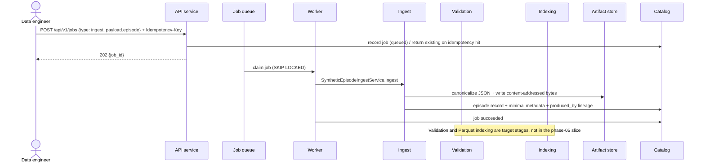
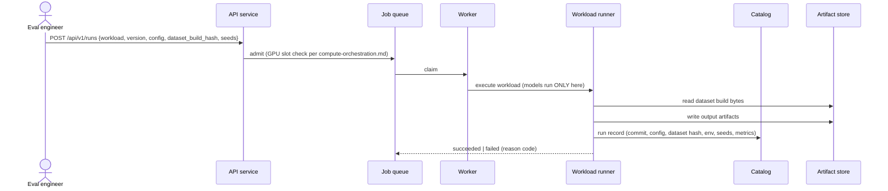
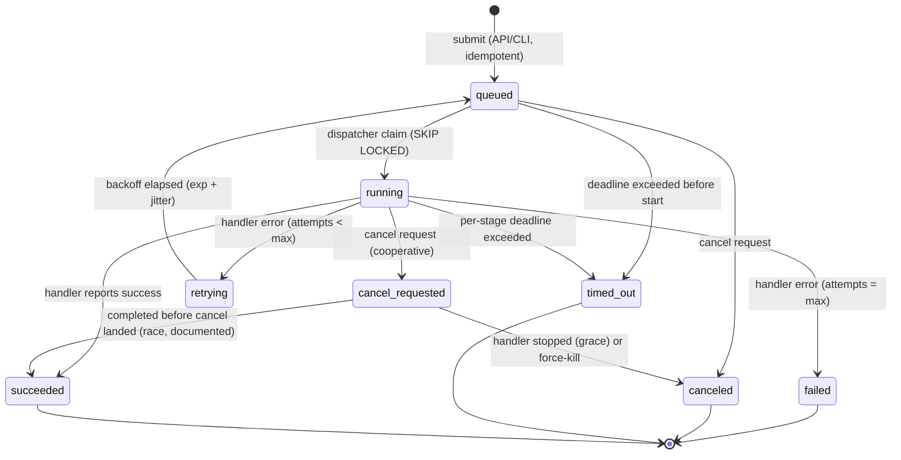

# Data Flow and Control Flow

Companion to [overview.md](overview.md). Components: [components.md](components.md). All arrows carry correlation IDs
(`ingest_id` / `job_id` / `run_id` / `episode_id`) per [../observability/conventions.md](../observability/conventions.md).

## 1. Ingest → validate → index (data engineer path)



Failed validation does **not** run indexing: the episode lands in `quarantined` with reason codes (FR-002/FR-003),
visible in the UI's failures view.

## 2. Curate → build (ML engineer path)

```mermaid
sequenceDiagram
  actor ME as ML engineer
  participant API as API service
  participant Q as Job queue
  participant W as Worker
  participant B as Builds
  participant C as Catalog
  participant A as Artifact store

  ME->>API: POST /api/v1/builds {selection query, config}
  API->>C: snapshot selection (sorted episode hashes) → plan
  API-->>ME: 202 {build_id, manifest draft hash}
  Q->>W: claim build job
  W->>B: materialize
  B->>A: stage LeRobot v3 dir (temp)
  B->>A: hash → atomic publish (build/<manifest_hash>)
  B->>C: dataset_build + manifest + lineage edges (target behavior; not implemented in phase 05)
  B-->>Q: succeeded
  ME->>API: GET /api/v1/builds/{id}/manifest
  API-->>ME: manifest (hash, sources, profile hash, commit, config)
```

Determinism (NFR-004): re-running the same plan produces the same `manifest_hash` and reuses/publishes identical bytes.

## 3. Workload run (eval engineer path)



## 4. Job lifecycle state machine



Transition owners and guarantees:

| Transition | Triggered by | Guarantee |
|---|---|---|
| submit → queued | API/CLI via catalog transaction | Idempotency-Key dedupe (FR-001/FR-013) |
| queued → running | dispatcher (atomic claim) | At-least-once delivery; claimed rows carry `worker_id` + `lease_expires_at` |
| running → retrying → queued | worker error report; retry policy | Bounded attempts, exponential backoff with jitter (per-stage class) |
| running → timed_out | deadline monitor (worker-side watchdog + dispatcher sweep) | Idempotent handlers make late completion safe to discard |
| running → cancel_requested → canceled | API cancel; cooperative flag checked between work units; force-kill after grace period | Cancel is best-effort on wall-clock ≤ 2 s target (NFR-005) |
| lease expiry → queued | heartbeat staleness (worker death) | In-flight work may repeat (at-least-once; ADR 0005) |
| any → terminal | catalog transaction | Terminal states immutable; retries after terminal are new jobs |

State names in the schema: `queued`, `running`, `retrying`, `cancel_requested`, `succeeded`, `failed`, `canceled`,
`timed_out` (job-state contract in [../spec/requirements.md](../spec/requirements.md) §4 keeps `queued→canceled` etc.
compatible).

## 5. Control flow summary

- **Synchronous path:** HTTP request → API → catalog read/write (CRUD, queries). No pipeline work inline.
- **Asynchronous path:** everything with side effects on data is a job: `ingest`, `validate`, `index`, `build`,
  `workload`, `gc` (orphan cleanup). Chaining (ingest→validate→index) is expressed as stage jobs with parent linkage,
  so each stage is individually retryable and observable (partial-pipeline failure mode).
- **Polling/streaming:** v1 the UI polls job status (interval per [frontend.md](frontend.md)); server-sent events are
  a deferred trigger item.
