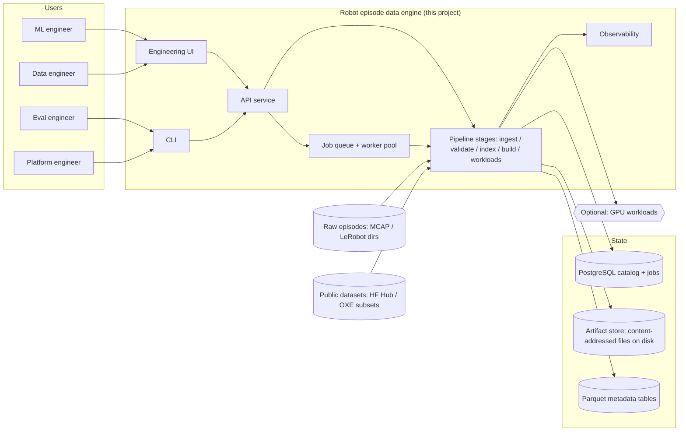
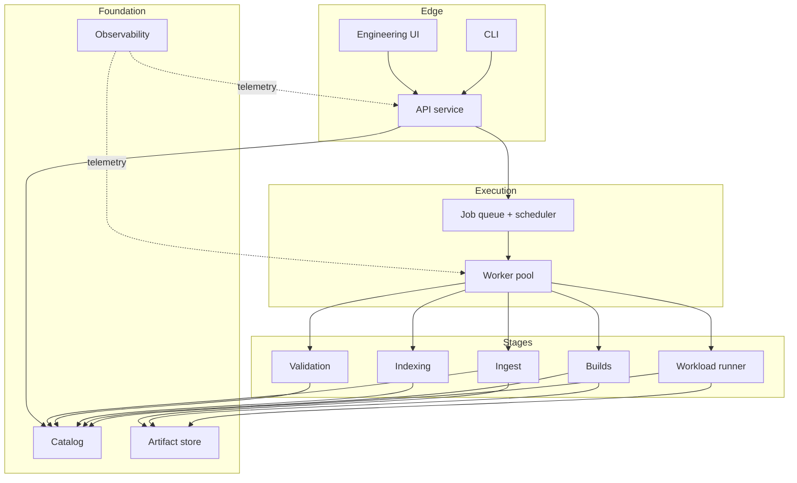

# Architecture Overview

**Robot episode data engine** — see [../spec/problem.md](../spec/problem.md). Status: written (phase 03, 2026-09-28).
Diagrams use Mermaid. Decisions live in [../decisions/](../decisions/) (ADRs 0003–0010).

## Purpose

Ingest raw robot episodes (MCAP, LeRobot), validate them against declared rules, index them into a versioned catalog
with full lineage, and serve reproducible curated dataset builds (LeRobot v3) to ML workloads — with a real job
lifecycle, observability, benchmarks, and an engineering UI. The platform is the product; models are workloads.

## Context diagram

## Principles

1. **Platform is the product** — models execute only behind the narrow workload interface ([api.md](api.md));
   no model code in the API or catalog (CLAUDE.md non-negotiable, FR-012).
2. **Contracts over frameworks** — adopt ecosystem formats (MCAP, LeRobot v3, Parquet/Arrow) at every boundary;
   never invent a format (ADR [0006](../decisions/0006-storage-and-formats.md)).
3. **Determinism by construction** — content addressing + canonical manifests make rebuilds hash-identical
   (NFR-004; ADR 0006/0007).
4. **Build thin, adopt sparingly** — the job queue, lineage, and run records are ~small code we must own to test
   (ADR [0005](../decisions/0005-catalog-and-job-queue.md), [0007](../decisions/0007-lineage-and-run-records.md));
   everything else is deferred behind a stated trigger.
5. **Observable by default** — every request/job/run carries correlation IDs; runtime metrics share the benchmark
   schema (ADR [0008](../decisions/0008-observability.md)).
6. **Fail honestly** — at-least-once execution with idempotent handlers, stable error/reason codes, quarantined data
   (never silently dropped).
7. **Local-first, migration-ready** — one machine is the design point (environment.md); object-store and multi-node
   paths stay open via the triggers in [technology-decision-matrix.md](technology-decision-matrix.md).

## Component map

Per-component detail: [components.md](components.md). Sequences and job state machine: [data-flow.md](data-flow.md).
Where code belongs: [repo-layout.md](repo-layout.md). Trade-offs: [trade-offs.md](trade-offs.md).
